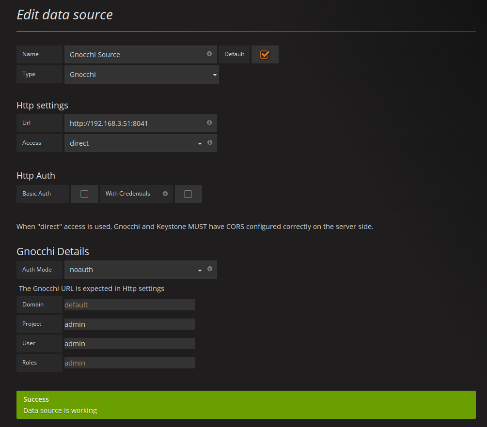
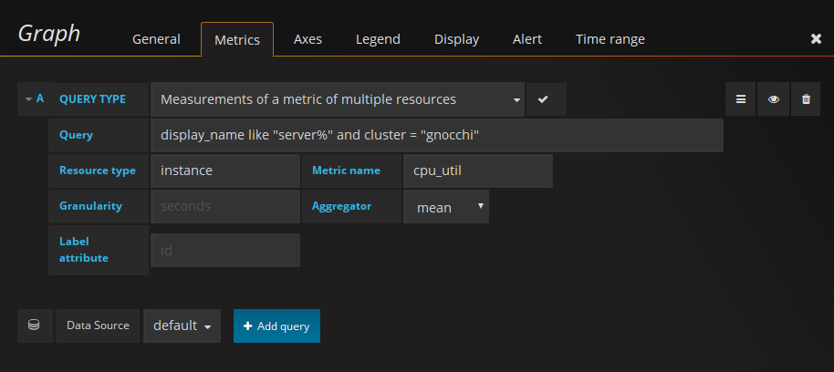
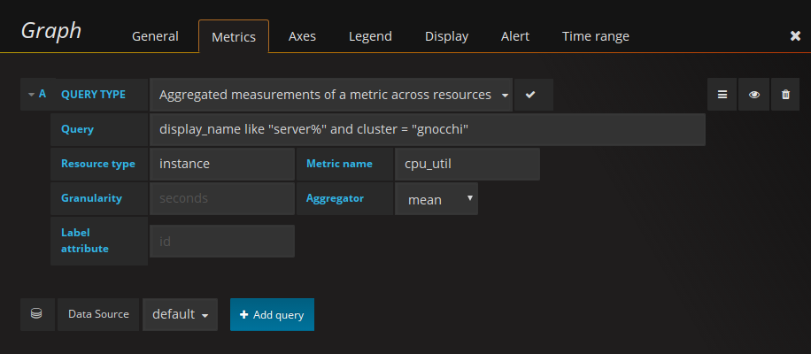

# Grafana Gnocchi datasource 

Gnocchi datasource for Grafana 3.x

## Installation via grafana.net

    $ sudo grafana-cli plugins install sileht-gnocchi-datasource

## Installation from sources

    $ npm install
    $ ./run-tests.sh  # This also build the plugin under dist/

    $ ln -s dist /var/lib/grafana/plugins/grafana-gnocchi-datasource
    $ # or
    $ cp -a dist /var/lib/grafana/plugins/grafana-gnocchi-datasource

## Configuration Panel

Name | Description
------------ | -------------
Name | The data source name.
Default | Default data source means that it will be pre-selected for new panels.
Url | The http protocol, ip and port of your Keystone or Gnocchi server (default port is usually 8080)
Access | Proxy = access via Grafana backend, Direct = access directory from browser.
Token | A valid Keystone token
Project | The keystone user
User | The Keystone user
Password | The Keystone password

Note: If the Keystone server is set as URL, the Gnocchi server will be autodiscovered.
This works only if Access = Direct, and CORS is properly configured on Keystone and Gnocchi side.

## Query editor

Open a graph in edit mode by click the title.

The editor have 4 modes to retreives metrics, you can change the mode by clicking of the pencil on the right.

* Measurements of a metric:
  Create one graph with datapoint of the defined metric

  

  Metric ID: the id of the metric you are interrested in

* Measurements of a metric of a resource:
  Create one graph with datapoint of the metric of the defined resource.

  

  Resource ID: the id of the resource
  Resource type: the type of the resource (generic, instance, disk, ...)
  Metric name: the name of the metric

* Measurements of a metric of multiple resources:
  Create one graph per metric find with the query.

  

  Query: the query to search resources
  Resource type: the type of the resource (generic, instance, disk, ...)
  Metric name: the name of the metric
  Label attribute: the label or the resource attribute to use as label.

* Aggregated measurements of a metric across resources:
  Create one graph with an aggregation of all datapoints of metrics that match the query.

  

  Query: the query to search resources
  Resource type: the type of the resource (generic, instance, disk, ...)
  Metric name: the name of the metric
  Label attribute: the label or the resource attribute to use as label.

Each mode also have the aggregator method to use to get datapoints of the metrics.

For details of `Query` format, please refer to the Gnocchi documentations.

- [Search for resource - Gnocchi Documentation](http://docs.openstack.org/developer/gnocchi/rest.html#searching-for-resources).

## Templated queries

Gnocchi Datasource Plugin provides following functions in `Variables values query` field in Templating Editor.

Name | Description
| ------- | --------|
`metrics(resource_id)`  | Returns a list of metrics avialable for the resource identified by ‘resource_id’
`resources(resource_type, `attribute`, query)` | Returns a list of resource `attribute` matching `query`.

For details of `query` format, please refer to the Gnocchi documentations.

- [Searching for resources - Gnocchi documentation](http://docs.openstack.org/developer/gnocchi/rest.html#searching-for-resources).

## Current Limitation

Grafana doesn’t allow to query two different servers when using the proxy mode,
so we are not able to query Keystone for a token and then query gnocchi.

In proxymode, we need to set a token and the Gnocchi URL on the datasource.

In direct mode, we can use login/password and the Keystone URL.
Note that CORS MUST be enabled on Keystone and Gnocchi servers.

## License

APACHE LICENSE Version 2.0, January 2004
